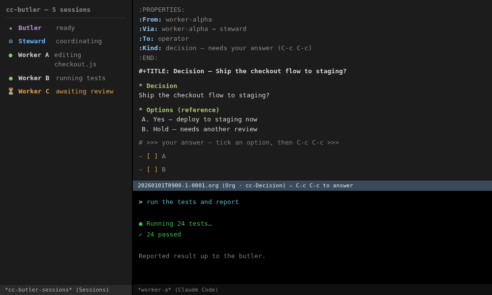
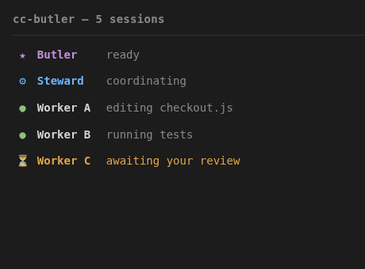
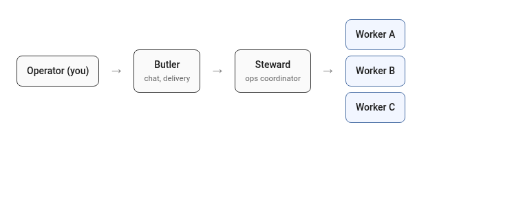
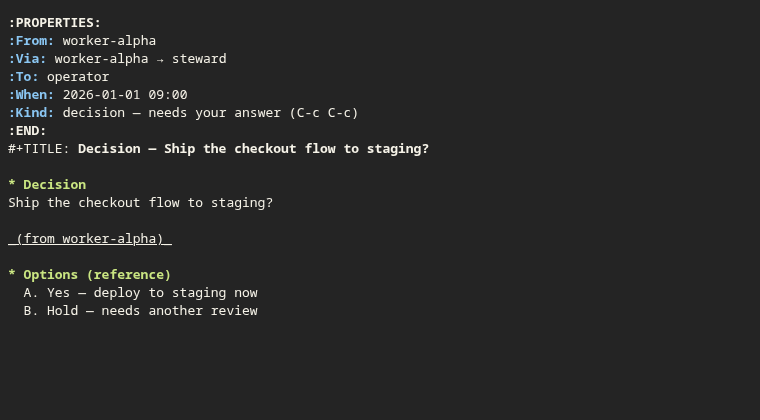
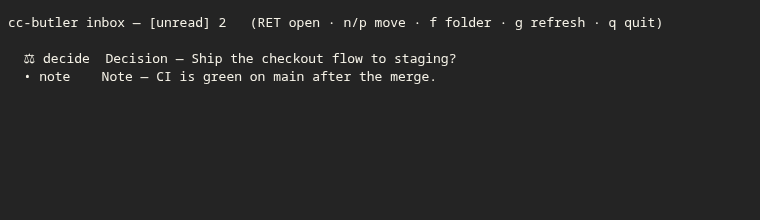
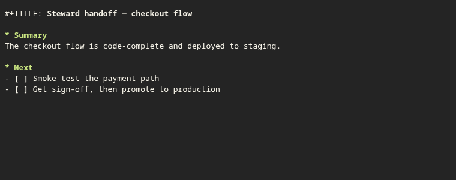
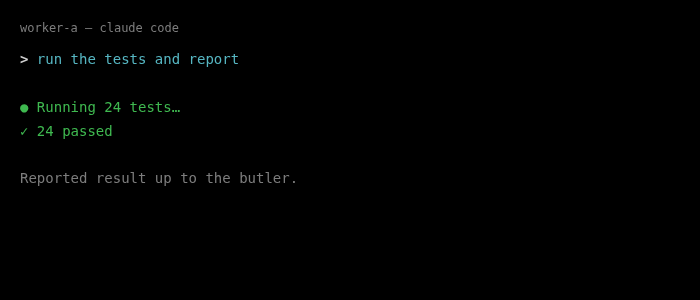

#+TITLE: cc-butler
#+AUTHOR: Jeongsoo Park
#+OPTIONS: toc:nil num:nil

/A cmux-like manager and control plane for running many concurrent Claude Code
sessions in one Emacs./

=cc-butler= turns [[https://github.com/manzaltu/claude-code-ide.el][claude-code-ide]] into a multi-session cockpit: a sticky list of
every live session, a *butler/worker* orchestration layer where one designated
session drives the others, a per-session *document panel*, and a butler-owned
*document repository* that keeps a live dashboard and an append-only log.

The original motivation: when you run several Claude Code agents at once, their
output scrolls away and the overall state of the work becomes impossible to
hold in your head. cc-butler makes the fleet legible — and lets one *butler*
session (which you can drive from your phone) coordinate the rest.

* Screenshots

(Mocked content — no real project or session data.)

The session list (left) beside a worker's terminal (right). ~household.png~
below is the roles diagram; the rest illustrate individual features.

|  |   |
|      |  |
|      |    |

* Features

- *Session list* (~M-x cc-butler~) — a sticky left side window listing every
  live session as a readable multi-line block (title / current activity /
  status / branch + PR). Navigating previews the session's terminal.
- *Per-session metadata* — a running Claude sets its own title/status via the
  ~set_session_info~ MCP tool, so you can track many sessions at a glance.
- *Topic workspaces* — ~cc-butler-new-topic~ (~N~) scaffolds a workspace
  (clones + markers) and launches a session; ~cc-butler-close-topic~ (~K~)
  tears one down *safely* (it refuses to delete unless every git clone has no
  local-only commits, a clean tree, and no stashes — checked with real
  =git=). The package ships one built-in template, ~default~ (a repo-free
  scaffold — no cloning, just a workspace dir), plus an ~arbitrary~ escape
  hatch (pick any directory, no scaffolding); register your own real-repo
  templates with ~cc-butler-define-project-template~ in your own config (see
  its docstring).
- *Butler / worker control plane* — a designated /butler/ session drives the
  /workers/ through MCP tools (~list_claude_sessions~, ~read_session_output~,
  ~send_to_session~) and receives their events (~report_to_steward~ →
  ~pending_events~). You remote-control one session; it becomes the situation
  room for the rest.
- *Document panel* — a running Claude opens a PR, issue, CI run, or file into a
  right-hand panel beside its terminal (~show_document~), shown as a tab line;
  the set is remembered per session. Read-only with explicit actions
  (comment / browse). You can also open one yourself with ~o~ (or ~C-c d o~
  from anywhere) — see [[*The document panel][The document panel]] below; the panel stays
  invisible until at least one document has been opened for that session, so
  don't mistake an empty panel for a missing feature.
- *Inbox* — decisions/notes the butler or steward escalates land in a
  reviewable list (~M-x cc-butler-inbox~, ~i~ in the session list); see
  [[*The inbox][The inbox]] below for what populates it.
- *Butler document repository* — the butler keeps a regenerated =dashboard.org=
  (sessions table auto-built from live state + overview + open decisions) and
  an append-only daily log, updated via ~butler_log~ / ~butler_dashboard~ and
  auto-captured worker events.

* Requirements

- *Emacs* 29.1 or newer.
- [[https://github.com/manzaltu/claude-code-ide.el][claude-code-ide.el]] — the Claude Code IDE integration for Emacs (the session
  backend and MCP bridge this package builds on).
- *ghostel* — the terminal backend that claude-code-ide drives; cc-butler reads
  its live terminal state (OSC titles, screen capture) and rides its
  notification callback. *Not* a formal dependency of either package (neither
  declares it in ~Package-Requires~), so on a fresh install it is easy to skip
  — but without it, sessions still launch under claude-code-ide's default
  ~vterm~ backend, just with cc-butler's OSC-title tracking, terminal resize,
  and screen-refresh features silently disabled. Install it separately, then:
  #+begin_src emacs-lisp
  (setq claude-code-ide-terminal-backend 'ghostel)
  #+end_src

The [[https://claude.com/claude-code][Claude Code]] CLI itself must be installed and on ~claude-code-ide-cli-path~
(default ~"claude"~, resolved via ~PATH~). *If you use the ghostel backend*,
set this to an *absolute, tilde-free* path instead of relying on the default —
ghostel spawns the process directly via ~execvp~ with no shell, so a literal
~"~/..."~ is never expanded and the process dies instantly, surfacing as a
bare "Invalid buffer" error with no indication why:
#+begin_src emacs-lisp
(setq claude-code-ide-cli-path (executable-find "claude"))
#+end_src

Run ~M-x cc-butler-doctor~ (~h~ in the session list) any time to check these —
useful right after a fresh install, since none of the above is verified or
installed by ~(require 'cc-butler)~ itself.

* Installation

cc-butler is not on a package archive yet, so it installs straight from Git.
One wrinkle to know first: its ~claude-code-ide~ dependency is *also* GitHub-only
(not on MELPA/GNU ELPA), so a package manager that tries to satisfy it from an
archive will fail. *Install ~claude-code-ide~ first, then cc-butler* — the
recipes below do this in order. (The other dependency, ~hydra~, is on MELPA and
resolves automatically.)

** Built-in use-package + ~:vc~ (Emacs 30+)

Emacs 30 ships a ~:vc~ keyword in ~use-package~, so no third-party package
manager is needed. Make sure MELPA is registered (for ~hydra~):

#+begin_src emacs-lisp
(require 'package)
(add-to-list 'package-archives '("melpa" . "https://melpa.org/packages/") t)
(package-initialize)

;; 1. GitHub-only dependency first
(use-package claude-code-ide
  :vc (:url "https://github.com/manzaltu/claude-code-ide.el" :rev :newest))

;; 2. then cc-butler
(use-package cc-butler
  :vc (:url "https://github.com/toracle/cc-butler" :rev :newest)
  :after claude-code-ide)
#+end_src

Upgrade later with ~M-x package-vc-upgrade RET cc-butler RET~.

*** Emacs 29

The ~:vc~ keyword is Emacs 30+. On 29.x, install with ~package-vc-install~ (run
once), then configure with plain ~use-package~:

#+begin_src emacs-lisp
(unless (package-installed-p 'claude-code-ide)
  (package-vc-install "https://github.com/manzaltu/claude-code-ide.el"))
(unless (package-installed-p 'cc-butler)
  (package-vc-install "https://github.com/toracle/cc-butler"))

(use-package cc-butler
  :after claude-code-ide)
#+end_src

** straight.el + use-package

straight reads ~Package-Requires~ and pulls ~hydra~ from MELPA for you:

#+begin_src emacs-lisp
(use-package claude-code-ide
  :straight (:host github :repo "manzaltu/claude-code-ide.el"))

(use-package cc-butler
  :straight (:host github :repo "toracle/cc-butler")
  :after claude-code-ide)
#+end_src

** Manual clone

Or clone both repos and put them on your ~load-path~:

#+begin_src emacs-lisp
(add-to-list 'load-path "/path/to/claude-code-ide.el")
(add-to-list 'load-path "/path/to/cc-butler")
(require 'cc-butler)
#+end_src

After any of these, run ~M-x cc-butler-doctor~ to check for fresh-install gaps
(CLI path, ghostel backend, etc.) — see [[*Requirements][Requirements]] above.

* Usage

~M-x cc-butler~ opens the session manager. In the list buffer, ~?~ opens a
discoverable Hydra menu of everything below (mirroring the same ~?~ → menu
pattern used by the decision reader) — press it any time you forget a key:

| Key     | Action                                              |
|---------+------------------------------------------------------|
| ~n~/~p~     | move + preview a session                            |
| ~RET~     | select the session's terminal                       |
| ~SPC~     | preview without switching                            |
| ~B~       | start (or focus) the dedicated butler session       |
| ~S~       | start (or focus) the dedicated steward session      |
| ~N~       | create a topic workspace                            |
| ~K~       | close a topic safely (vet → kill → delete)          |
| ~b~       | designate the session at point as the butler        |
| ~i~       | open the inbox (see [[*The inbox][The inbox]])                       |
| ~d~/~o~/~v~/~D~ | doc-panel toggle / open / reopen / remove (see below) |
| ~c~       | start a plain session (no scaffolding)               |
| ~l~       | show the cc-butler log                               |
| ~g~       | refresh                                             |
| ~h~       | ~cc-butler-doctor~ — check for fresh-install gaps   |
| ~?~       | open this Hydra menu                                |
| ~q~       | quit the session manager                             |

A running Claude drives its own panel and reports to the butler through the MCP
tools listed above.

** The document panel

A per-session right-hand panel for PRs, issues, CI runs, and files. It stays
*invisible* until at least one document has been opened for that session —
there is no persistent empty-state placeholder, so a session with nothing
opened yet looks identical to the panel not existing at all. Two ways to
populate it:

- *Automatically*: a running Claude calls the ~show_document~ MCP tool.
- *Manually*: press ~o~ in the session list (or ~C-c d o~ from anywhere in
  Emacs) to open a document into the session at point.

Once at least one document is open, further keys apply: ~d~ toggles the panel
visible/hidden, ~]~/~[~ move between open documents, ~v~ reopens the
last-closed one, and ~D~ removes the current one from the set.

** The inbox

~M-x cc-butler-inbox~ (~i~ in the session list) lists decision/note documents
the butler or steward has escalated for a human to review and answer — *not*
the agent-to-agent messaging worker sessions use internally (~ask_worker~ /
~check_inbox~ / ~report_to_steward~, which self-initialize and need no setup).
The human inbox only starts filling once you have actually launched a butler
and/or steward session at least once (~B~ / ~S~) — those launches write the
hooks that auto-drain escalated decisions into it. An empty inbox on a fresh
install usually just means neither has been started yet, not that anything is
broken.

** The butler

~M-x cc-butler-start-butler~ (~B~) launches a dedicated *butler* session in
~cc-butler-home~ (default =~/.emacs.d/cc-butler/butler=), scaffolding a =.projectile=
marker and a role =CLAUDE.md= there on first run, and designating it the butler.
Point ~cc-butler-home~ at an existing directory to reuse it. (~b~ still lets you
mark any session the butler by hand.)

** The steward

~M-x cc-butler-start-steward~ (~S~) launches a dedicated *steward* session in
~cc-butler-steward-home~ (default =~/.emacs.d/cc-butler/steward=), the same way.
Once running, the worker firehose (nudges + ~report_to_steward~) routes to the
steward instead of the butler (split mode) — the butler then only ever sees
decisions the steward escalates to it (~escalate_to_butler~ /
~pending_decisions~), never the raw worker chatter.

* License

MIT — see [[file:LICENSE][LICENSE]]. Copyright (c) 2026 Jeongsoo Park.
